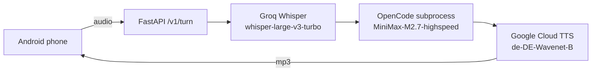
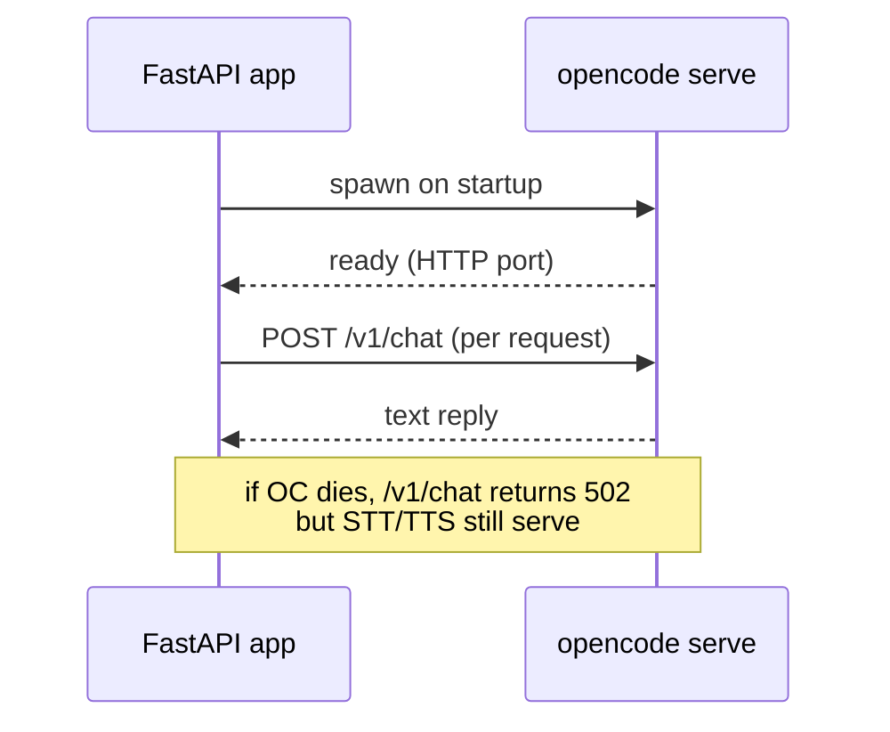

<div class="audit-banner">

**Code not published.** The repository is private. The deployment is tied to a specific VPS, a Google Cloud service-account JSON, and an Android phone that wakes the laptop on demand. Stripping those dependencies for a public release is more work than the code is worth as a portfolio artefact.

</div>

---

##### Pipeline



Three stages in sequence; each can be replaced or scaled independently. STT and TTS calls are async; the LLM subprocess is spawned at app startup via FastAPI lifespan.

---

##### Endpoints

| Route | Method | Purpose |
|---|---|---|
| `/health` | GET | Liveness probe (returns OK if STT/TTS credentials load) |
| `/v1/stt` | POST | Audio file → transcript |
| `/v1/chat` | POST | Text → text reply (LLM only) |
| `/v1/tts` | POST | Text → mp3 |
| `/v1/turn` | POST | Audio → transcript + reply + mp3 (full loop) |

---

##### Stack

| Component | Choice | Why |
|---|---|---|
| STT | Groq Whisper large-v3-turbo | Sub-second transcription at low cost |
| LLM | OpenCode subprocess (MiniMax-M2.7-highspeed) | Local control over model + tool routing |
| TTS | Google Cloud TTS (de-DE-Wavenet-B) | Best DE voice quality per cost at time of build |
| Server | FastAPI on uvicorn, systemd-managed | Standard, restart on crash |
| Wake | Laptop puller via systemd-user unit + SSH | Phone pings VPS → VPS pulls laptop to handle heavy inference |

---

##### OpenCode subprocess (lifespan-managed)



The OpenCode manager handles spawn, health-check, and restart on the FastAPI lifespan. If OpenCode is unreachable (e.g., low RAM on the VPS), `/v1/chat` and `/v1/turn` return 502; `/v1/stt` and `/v1/tts` stay operational.

---

##### Source layout (private repo)

```
backend/
  config.py              env-driven settings
  groq/                  Groq STT client
  opencode_manager.py    spawns `opencode serve`
  pipeline.py            async STT/LLM/TTS glue
  tts_helper.py          Google Cloud TTS wrapper
  app.py                 routes
tts/synth.py             CLI + lib for Google TTS
opencode/                Vendored OpenCode monorepo (Bun)
Secrets/                 .env + GCP service-account JSON (gitignored)
Tests/                   Audio samples for end-to-end testing
```

---

##### Why this isn't on GitHub

The repo contains:
- Hardcoded VPS hostnames
- GCP service-account JSON (gitignored but still in working tree)
- Phone-specific webhook URLs
- systemd unit files with my user/group IDs

Cleaning all of that into a reproducible public release is real work. The architecture diagram above and the endpoint table capture what the system is for someone reading this site — the actual code is one request away if you want to talk about it.
